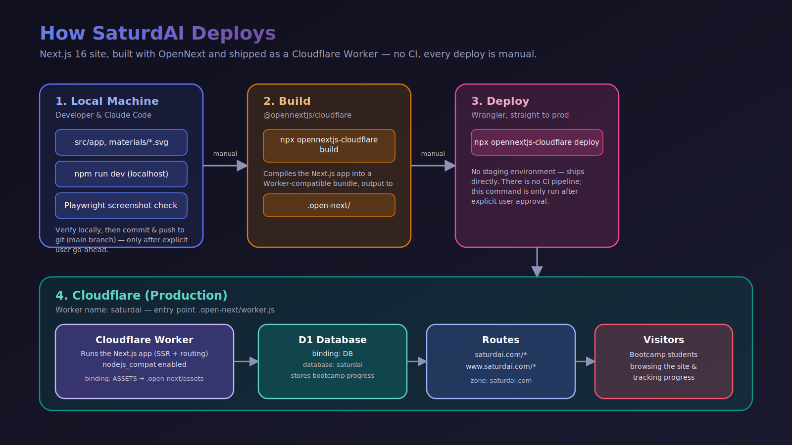

# Deployment Architecture

The site is a Next.js 16 app built with [OpenNext](https://opennext.js.org/cloudflare) and shipped as a **Cloudflare Worker** (not Cloudflare Pages), backed by a Cloudflare D1 database. There is no CI — every deploy is a manual, two-command process run straight to production (`saturdai.com` and `www.saturdai.com`, no staging environment).

## Stages

1. **Local machine** — development happens in `npm run dev`, with changes verified locally (including Playwright screenshots) before anything is committed or pushed to the `main` branch on git.
2. **Build** — `npx opennextjs-cloudflare build` compiles the Next.js app into a Worker-compatible bundle in `.open-next/`.
3. **Deploy** — `npx opennextjs-cloudflare deploy` (Wrangler under the hood) pushes that bundle straight to production. This step is only ever run after explicit user go-ahead.
4. **Cloudflare (production)** — the `saturdai` Worker (`.open-next/worker.js`, `nodejs_compat` enabled) serves all requests:
   - Static assets via the `ASSETS` binding (`.open-next/assets`)
   - App data via the `DB` binding to the `saturdai` D1 database (bootcamp progress tracking)
   - Traffic routed in from the `saturdai.com` zone for both `saturdai.com/*` and `www.saturdai.com/*`

## Source of truth

Configuration lives in [`wrangler.toml`](../wrangler.toml) (Worker name, routes, D1 binding) and [`AGENTS.md`](../AGENTS.md) (workflow rules for when deploys are allowed to run).
